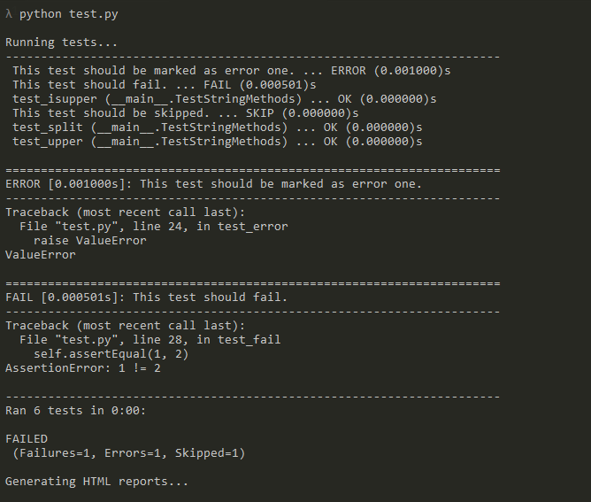
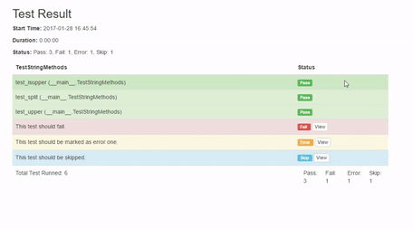

# HtmlTestRunner


[](https://pypi.python.org/pypi/html-testRunner)
[](https://travis-ci.org/oldani/HtmlTestRunner)


HtmlTest runner is a unittest test runner that saves results in a human-readable HTML format.

This Package was inspired by ``unittest-xml-reporting`` and
``HtmlTestRunner by tungwaiyip`` and began by combining the methodology of the former with the functionality of the latter.

## Table of Content

- [Intallation](#installation)
- [Usage](#usage)
- [Console Output](#console-output)
- [Test Results](#test-result)
- [Todo](#todo)
- [Contributing](#contributing)
- [Credits](#credits)

## Installation


To install HtmlTestRunner, run this command in your terminal:

```batch
$ pip install html-testRunner
```

This is the preferred method to install HtmlTestRunner, as it will always install the most recent stable release.
If you don't have [pip](https://pip.pypa.io) installed, this [Python installation guide](http://docs.python-guide.org/en/latest/starting/installation/) can guide
you through the process.


## Usage:

### With unittest.main()

```python

import HtmlTestRunner
import unittest


class TestStringMethods(unittest.TestCase):
    """ Example test for HtmlRunner. """

    def test_upper(self):
        self.assertEqual('foo'.upper(), 'FOO')

    def test_isupper(self):
        self.assertTrue('FOO'.isupper())
        self.assertFalse('Foo'.isupper())

    def test_split(self):
        s = 'hello world'
        self.assertEqual(s.split(), ['hello', 'world'])
        # check that s.split fails when the separator is not a string
        with self.assertRaises(TypeError):
            s.split(2)

    def test_error(self):
        """ This test should be marked as error one. """
        raise ValueError

    def test_fail(self):
        """ This test should fail. """
        self.assertEqual(1, 2)

    @unittest.skip("This is a skipped test.")
    def test_skip(self):
        """ This test should be skipped. """
        pass

if __name__ == '__main__':
    unittest.main(testRunner=HtmlTestRunner.HTMLTestRunner())
```

Just import `HtmlTestRunner` from package, then pass it to `unittest.main` with the `testRunner` keyword.
Tests will be saved under a reports/ directory by default (the `output` kwarg controls this.).

### With Test Suites
`HtmlTestRunner` can also be used with `test suites`; just create a runner instance and call the run method with your suite.
Here an example:

```python
from unittest import TestLoader, TestSuite
from HtmlTestRunner import HTMLTestRunner
import ExampleTest
import Example2Test

example_tests = TestLoader().loadTestsFromTestCase(ExampleTest)
example2_tests = TestLoader().loadTestsFromTestCase(Example2Test)

suite = TestSuite([example_tests, example2_tests])

runner = HTMLTestRunner(output='example_suite')

runner.run(suite)
```

### Combining Reports into a Single Report

By default, separate reports will be produced for each `TestCase`.
The `combine_reports` boolean kwarg can be used to tell `HTMLTestRunner` to instead produce a single report:
 ```python
import HtmlTestRunner
h = HtmlTestRunner.HTMLTestRunner(combine_reports=True).run(suite)
 ```

### Setting a filename
By default the name of the HTML file(s) produced will be created by joining the names of each test case together.
The `report_name` kwarg can be used to specify a custom filename.
For example, the following will produce a report file called "MyReport.html":

```python
import HtmlTestRunner
h = HtmlTestRunner.HTMLTestRunner(combine_reports=True, report_name="MyReport", add_timestamp=False).run(suite)
```

## Console output:



This is an example of the console output expected when using `HTMLTestRunner`.


## Test Result:



This is a sample of the results from the template that came by default with the runner.

## Custom Templates:

If you want to use your own template you can pass the absolute path when instantiating the `HTMLTestRunner` class using the `template` kwarg:
 ```python
import HtmlTestRunner
h = HtmlTestRunner.HTMLTestRunner(template='path/to/template')
 ```
Your template must use `jinja2` syntax, since this is the engine we use.


When using any template, the following variables will be available by default for use by `jinja2`:

- `title`: This is the report title - by default this is "Unittests Results" but can be changed using the `report_title` kwarg
- `headers`: This is a dict with 2 items:
    - `start_time`: A `datetime` object representing when the test was run
    - `status`: A dict of of the same form as the sub-dicts described below for `summaries` but for all tests combined
- `all_results`: A dict - keys are the names of each test case and values are lists containing test result objects (see the source code or the template for what information these provide)
- `summaries`: A dict - keys are the names of each test case and values are dicts containing:
    - `total`: The total number of tests
    - `success`: The number of passed tests
    - `failure`: The number of failed tests
    - `error`: The number of errored tests
    - `skip`: The number of skipped tests
    - `duration`: A string showing how long all these tests took to run in either seconds or milliseconds
    
Furthermore, you can provide any number of further variables to access from the template using the `template_args` kwarg.
For example, if you wanted to have the name of the logged in user available to insert into reports that could be achieved as follows:
```python
import getpass
import HtmlTestRunner

template_args = {
    "user": getpass.getuser()
}
h = HtmlTestRunner.HTMLTestRunner(template='path/to/template', template_args=template_args)
```

Now the user name can be accessed from a template using `jinja2` syntax: `{{ user }}`.


Click [here](docs/example_template.html) for a template example, this is the default one shipped with the package.


## TODO

- [ ] Add Test
- [ ] Improve documentation
- [x] Add custom templates
- [ ] Add xml results
- [ ] Add support for Python2.7
- [x] Add support for one report when running test suites.

## Contributing

Contributions are welcome, and they are greatly appreciated! Every
little bit helps, and credit will always be given.

For more info please click [here](./CONTRIBUTING.md)

## Credits

This package was created with Cookiecutter and the `audreyr/cookiecutter-pypackage` project template.

- [Cookiecutter](https://github.com/audreyr/cookiecutter)
- [audreyr/cookiecutter-pypackage](https://github.com/audreyr/cookiecutter-pypackage)

